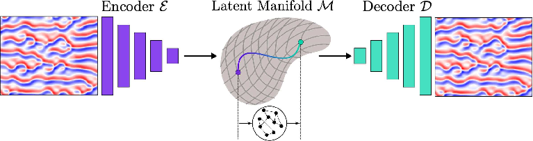
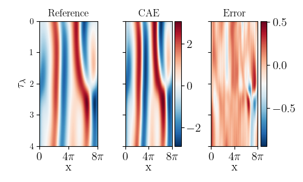
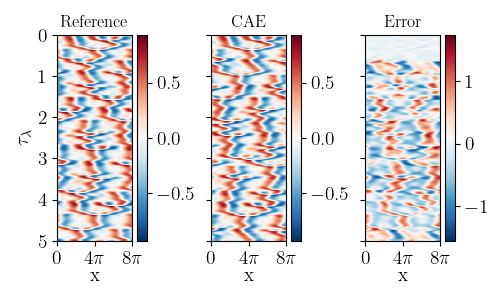

# CAE-ESN for the Kuramoto-Sivashinsky (KS) Equation

## Introduction
This repository demonstrates the use of a Convolutional Autoencoder (CAE) combined with an Echo State Network (ESN) to model the chaotic dynamics of the Kuramoto-Sivashinsky (KS) equation with a domain length \( L = 22 \).
The KS equation is a well-known example of a chaotic system used to study flame front instabilities and spatiotemporal chaos. The goal is to reduce the dimensionality of the system using a CAE and perform time series forecasting with an ESN. 
In the latent space, we perform latent stability analysis using Lyapunov exponents and Covariant Lyapunov vectors (CLVs).
<p align='center'>

</p>


## Kuramoto-Sivashinsky (KS) Equation
The Kuramoto–Sivashinsky (KS) equation is a fourth-order partial differential equation that models instabilities of flame fronts and represents a fundamental model in the study of spatiotemporally chaotic behaviour. Writing u = u(t,x), the equation is given by
$$ u_t+ u_{xx}+ u_{xxxx}+ uu_{x}  = 0$$
with periodic boundary conditions, $u (t, 0) = u (t, L)$ on the spatial domain $[0, L]$.  For L=22, the system is chaotic and the manifold's dimension $d_{M}$ is estimated to be of $d_{M}=8$ whilst the attractor's dimension is estimated at $d_{KY}=6.001$. 

## Convolutional Autoencoder (CAE)
The CAE is used to reduce the high-dimensional spatial states of the system to a lower-dimensional latent space. The architecture consists of:
- **Encoder:** Compresses the high-dimensional data into a lower-dimensional representation.
- **Decoder:** Reconstructs the original data from the latent representation.
An example of the training can be found in `tutorial/train_cae.ipynb`
<p align='center'>

</p>

## Echo State Network (ESN)
The ESN is a type of reservoir computing model that is used for time series forecasting. It consists of a large, fixed, and sparsely connected recurrent network (the reservoir) and a readout layer that is trained using linear regression. For this project, the ESN takes the latent variables generated by the CAE and predicts the future evolution.
An example of the ESN hyperparameter tuning can be found in `tutorial/validate_esn.ipynb`
<p align='center'>

</p>

## Lyapunov Exponent Calculation
To verify the chaotic nature of the predicted dynamics, the largest Lyapunov exponent is calculated from the time series generated by the ESN. The Lyapunov exponent characterizes the rate of divergence of nearby trajectories in phase space, indicating chaos if it is positive.

## Requirements
To run the code in this repository, you will need the following packages:

```
numpy
scipy
torch
matplotlib
einops
```
